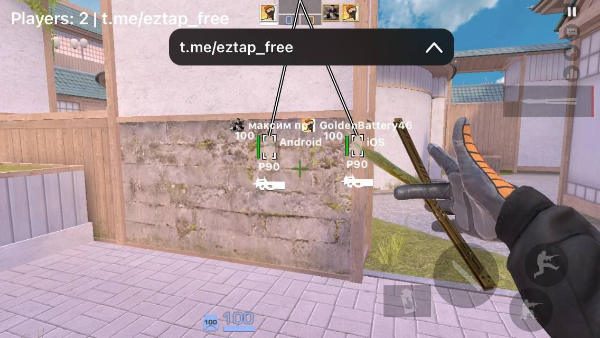
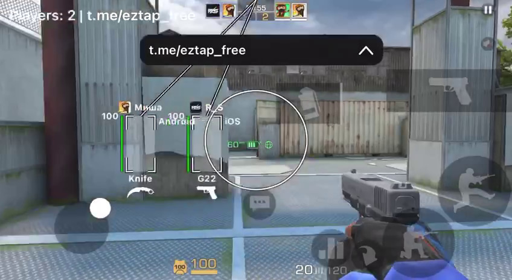

> [!NOTE]
> This documentation was generated by AI. / Эта документация была написана с помощью ИИ.

# 🏆 EzTap - Standoff 2 External (iOS)

<p align="center">
  
  
  
  
</p>

---

## 📸 Screenshots / Скриншоты
<p align="center">
  
  
</p>

---

##  English

### 📱 About the Project
**EzTap** is a high-performance external utility designed for Standoff 2 (**v0.37.0**) on iOS devices. It leverages the **TrollStore** environment to provide an external HUD (Head-Up Display) with advanced features. Unlike internal cheats, EzTap runs independently, making it more stable and harder to detect by simple integrity checks.

### 🚀 Key Features
*   **Overlay HUD:** A smooth, high-FPS overlay that displays information on top of the game.
*   **ESP (Extra Sensory Perception):** Real-time rendering of player locations, health, and more.
*   **SecureView Technology:** Uses specialized `UIView` extensions to hide the overlay from screen recordings and screenshots.
*   **Touch Injection:** Integrated touch simulation for interacting with the game environment.
*   **Memory Efficiency:** Optimized C++/Objective-C core to ensure no framedrops during gameplay.

### 🛠 How it Works
1.  **Overlay:** The app creates a top-most window using private Apple frameworks (`BackBoardServices`, `SpringBoardServices`).
2.  **Rendering:** Utilizes `CADisplayLink` for synchronization with the screen's refresh rate.
3.  **Protection:** Implements `SecureView` to ensure your gameplay remains private even while recording.
4.  **Deployment:** Compiled via **Theos** and packaged as a `.tipa` for easy installation on TrollStore-enabled devices.

---

##  Русский

### 📱 О проекте
**EzTap** — это высокопроизводительная внешняя утилита, разработанная для Standoff 2 (версия **0.37.0**) на iOS. Она использует среду **TrollStore** для предоставления внешнего HUD (интерфейса поверх игры) с продвинутыми функциями. В отличие от внутренних читов, EzTap работает независимо, что делает его более стабильным и сложным для обнаружения простыми проверками целостности.

### 🚀 Основные возможности
*   **Overlay HUD:** Плавное наложение с высоким FPS для отображения информации поверх игры.
*   **ESP (Extra Sensory Perception):** Отрисовка местоположения игроков, здоровья и другой информации в реальном времени.
*   **Технология SecureView:** Использует специальные расширения `UIView` для скрытия меню от записи экрана и скриншотов.
*   **Инъекция касаний:** Интегрированная симуляция нажатий для взаимодействия с игровым миром.
*   **Эффективность памяти:** Оптимизированное ядро на C++/Objective-C для отсутствия просадок FPS.

### 🛠 Как это работает
1.  **Оверлей:** Приложение создает окно поверх всех остальных, используя приватные фреймворки Apple (`BackBoardServices`, `SpringBoardServices`).
2.  **Рендеринг:** Использует `CADisplayLink` для синхронизации с частотой обновления экрана.
3.  **Защита:** Реализует `SecureView`, чтобы ваш геймплей оставался приватным даже во время записи видео.
4.  **Сборка:** Компилируется через **Theos** и упаковывается в формат `.tipa` для удобной установки через TrollStore.

---

### 📦 Compilation / Сборка

Requirement: **Theos** build system.

```bash
make package
```

The resulting `.tipa` or `.deb` will be in the `./packages` directory.

---
<p align="center">
  <i>Developed with ❤️ for the community.</i><br>
  <b><a href="https://t.me/project_fent">t.me/project_fent</a></b>
</p>
